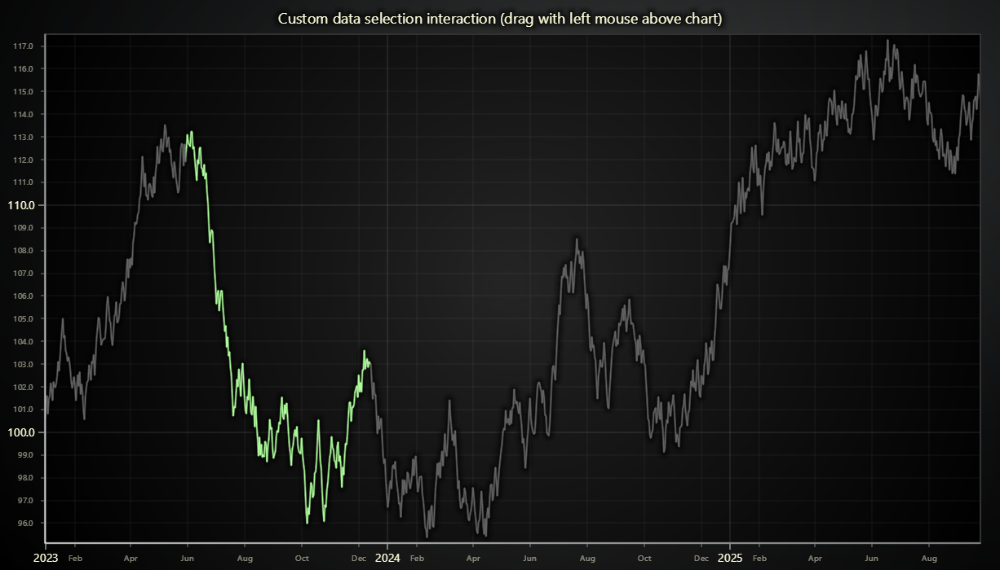

# JavaScript Custom Time Selection Chart



This demo application belongs to the set of examples for LightningChart JS, data visualization library for JavaScript.

LightningChart JS is entirely GPU accelerated and performance optimized charting library for presenting massive amounts of data. It offers an easy way of creating sophisticated and interactive charts and adding them to your website or web application.

The demo can be used as an example or a seed project. Local execution requires the following steps:

-   Make sure that relevant version of [Node.js](https://nodejs.org/en/download/) is installed
-   Open the project folder in a terminal:

          npm install              # fetches dependencies
          npm start                # builds an application and starts the development server

-   The application is available at _http://localhost:8080_ in your browser, webpack-dev-server provides hot reload functionality.


## Description

This example showcases the creation of a custom user interaction.

By default, dragging left mouse inside the series area, a zoom/fit interaction is activated.
This default interaction can be disabled:

```js
chart
    // Disable default chart interactions with left mouse button.
    .setMouseInteractionRectangleFit(false)
    .setMouseInteractionRectangleZoom(false)
```

And any custom interaction can be implemented with different event subscription methods.
In this example, `ChartXY.onSeriesBackgroundMouseDrag` is used to hook on to the event when user drags with mouse inside the series area.
An Axis band is used to highlight the selected time range, and after user stops dragging the Line series is colored so that selected points are focused whereas other points are "unfocused".

This idea of custom interactions can be extended to any application specific dynamic interaction, like deleting selected points, displaying them in a separate chart or moving them - imagination is the limit!

See also:

-   https://lightningchart.com/js-charts/interactive-examples/examples/lcjs-example-0040-customLassoInteraction.html


## API Links

* [Lightning chart]
* [Color factory CSS]
* [Solid line style]
* [Solid fill style]
* [Chart XY]


## Support

If you notice an error in the example code, please open an issue on [GitHub][0] repository of the entire example.

Official [API documentation][1] can be found on [LightningChart][2] website.

If the docs and other materials do not solve your problem as well as implementation help is needed, ask on [StackOverflow][3] (tagged lightningchart).

If you think you found a bug in the LightningChart JavaScript library, please contact sales@lightningchart.com.

Direct developer email support can be purchased through a [Support Plan][4] or by contacting sales@lightningchart.com.

[0]: https://github.com/Arction/
[1]: https://lightningchart.com/lightningchart-js-api-documentation/
[2]: https://lightningchart.com
[3]: https://stackoverflow.com/questions/tagged/lightningchart
[4]: https://lightningchart.com/support-services/

© LightningChart Ltd 2009-2022. All rights reserved.


[Lightning chart]: https://lightningchart.com/js-charts/api-documentation/v5.2.0/functions/lightningChart-1.html
[Color factory CSS]: https://lightningchart.com/js-charts/api-documentation/v5.2.0/functions/ColorCSS.html
[Solid line style]: https://lightningchart.com/js-charts/api-documentation/v5.2.0/classes/SolidLine.html
[Solid fill style]: https://lightningchart.com/js-charts/api-documentation/v5.2.0/classes/SolidFill.html
[Chart XY]: https://lightningchart.com/js-charts/api-documentation/v5.2.0/classes/ChartXY.html

